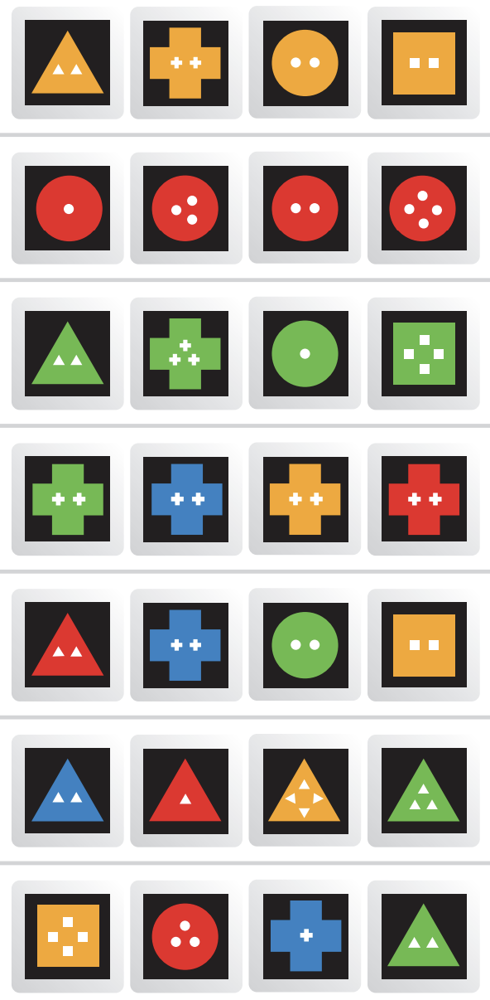

# iota

the great big game in the teeny-weeny tin

# Objective

Score the most points by adding cards in lines connected to the grid.
A line consists of 2, 3 or 4 cards straight in a row or column, in which each individual property (color, shape and number) is either the same on each card or different on each card.

## Set Up

Get a pencil and paper for scoring.
Shuffle and deal 4 cards face down to each player. (Look at them but keep them secret from opponents.)
Stack the remaining cards face down to form a draw pile.
Place the top card face up in the center of the playing area to form the starter card.
Notice that each card has three properties: a shape, a color and a number.

## How to Play

The teeniest person starts the game and play moves to the left.
On your turn, take one of two actions:

1. Add 1,2,3 or 4 cards in a single line, connecting to any card(s) already in play. All cards must follow the GuideLines, below. Record your score and then replenish your hand to 4 cards...

or

2. Pass... and trade some, all or none of your cards back to the bottom of the draw pile and take new ones.

## GuideLines

- All cards played must connect in a single straight line and at least one must connect to the grid.
- Although you must play cards in a single line, additional lines may be created and/or extended as a result. (See Turn 3 on other side for example.)
- You may create or extend a line by adding cards to both ends of it. (See Turn 2.)

## Scoring

After each turn, add up the face values of all cards in each line either created or extended on your turn.
If a card is part of 2 lines, it is counted twice.
Double points for the entire turn for each lot completed.
Double again for playing all 4 of your cards on one turn.

## Ending the Game

The game ends when the draw pile runs out and one player plays his or her last card. Double points for that turn. High score wins!

## Variations

• For a shorter game, play with half of the deck (include Wild cards).
• When playing with young children, ignore scoring: first player out of cards after the draw pile runs out wins.
• In every line, all cards must either be all the same or all different in each individual property: color, shape, and number. (See “How do you form a line?” below.)
• Cards may be played in any sequence.
• A 4 card line is called a lot. Creating one doubles your score for the turn.
• Maximum allowable line length is 4 cards.
• If there are any gaps, it’s not a line... and some spaces on the grid will be impossible to fill. Since any 2 cards have some or no properties in common, any 2 cards will work to begin a line. The 3rd and 4th cards in that line must satisfy the requirements set by the first 2 cards.
Therefore, before adding the 3rd card to a line, look at the 3 cards that would be in that line and ask yourself:

1. Are the colors either all the same or all different on each card?
2. Are the shapes either all the same or all different on each card?
3. Are the numbers either all the same or all different on each card?

If your answer is no to any of these, then it’s not an allowable move.
Ask yourself these same questions before adding the 4th card to create a lot.

## Rules of Play

How do you form a line?
Easy as 1 2 3

2-4 players • Ages 8 and up

## Play Example

### Turn 1

2 cards are played. Same number, different colors, different shapes.
6 points

### Turn 2

2 cards are played creating a new 3 card line. Same shape, different colors, different numbers. Cards must be played in a single line, though they needn‘t touch.
6 points

### Turn 3

2 cards are played. The yellow square 2 completes a lot. 2 new lines of 2 cards each are also created. 12 points for the 2 lines across (8+4). 5 points for the line up/down. Double for the lot.
34 points

### Turn 4

4 cards are played completing 2 lots. Face value of each lot is 10 points. A second line down worth 6 points is also extended for a total of 26. Double all points for lot 1. Double again for lot 2, and double again for playing all 4 cards!
208 points

## Wild Cards

A Wild card substitutes for any other card and has a face value of 0 points.
You may “recycle” a Wild card in play prior to your turn by exchanging it with a card from your hand that fits any line(s) it may be a part of.
You may then replay it on any turn. You do not have to name a Wild card when you play it. However, it must represent the same card if part of two lines.

## Examples of Lot rules

### 1

Same color on each card.
Different shapes on each card.
Same number on each card.

### 2

Same color on each card.
Same shape on each card.
Different numbers on each card.

### 3

Same color on each card.
Different shapes on each card.
Different numbers on each card.

### 4

Different colors on each card.
Same shape on each card.
Same number on each card.

### 5

Different colors on each card.
Different shapes on each card.
Same number on each card.

### 6

Different colors on each card.
Same shape on each card.
Different numbers on each card.

### 7

Different colors on each card.
Different shapes on each card.
Different numbers on each card.
